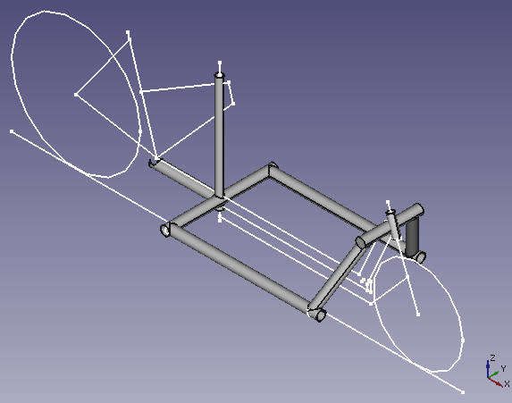

Introduction
============

The CAD file ``cargo_bike.fcstd`` contains a parametric design for a cargo bike
utilizing any arbitrary pre-built traditional bicycle frame and fork.
Surrounding files (such as shell scripts, python scripts, dockerfiles,
makefiles, etc.) provide the building blocks for automation infrastructure.

Design Notes
============

See wiki: https://wiki.sankey.info/index.php?title=Cargo_bike

The design is currently a WORK IN PROGRESS.

For a preview of the design, see screenshot:

Software
========

All development and scripts require FreeCAD 0.17+ and OCCT 7.1.0+.  Since these
bleeding edge versions can be difficult to obtain, a Dockerfile is provided to
run FreeCAD from the ``freecad-maintainers/freecad-daily`` PPA in an Ubuntu
image.

Docker on Debian 8 (jessie)
---------------------------

* Obtain the ``docker.io`` package from jessie-backports.
* Add your user to the docker group: ``sudo addgroup ${USER} docker``
* Build the docker image: ``make build-image``

License
=======

Copyright © 2017 Troy Sankey <sankeytms at gmail dot com>

This documentation describes Open Hardware and is licensed under the CERN OHL
v1.2.  You may redistribute and modify this documentation under the terms of
the CERN OHL v1.2 (http://ohwr.org/cernohl). This documentation is distributed
WITHOUT ANY EXPRESS OR IMPLIED WARRANTY, INCLUDING OF MERCHANTABILITY,
SATISFACTORY QUALITY AND FITNESS FOR A PARTICULAR PURPOSE.  Please see the CERN
OHL v1.2 for applicable conditions.
